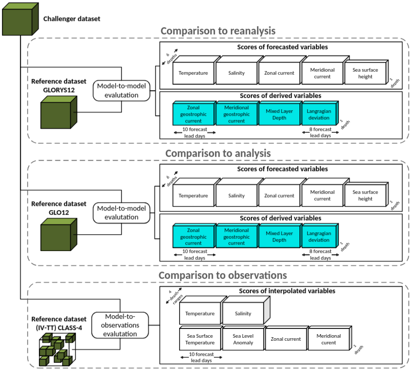

.. SPDX-FileCopyrightText: 2025 Mercator Ocean International <https://www.mercator-ocean.eu/>
..
.. SPDX-License-Identifier: EUPL-1.2

.. _evaluation-methods-page:

===================================================
Definitions of evaluation methods
===================================================

Several methods are used to evaluate forecasting systems in OceanBench.
Each of them is applied to a dataset grouping 52 forecasts in the year 2024.

The following figure provides an overview of the evaluation methodology, illustrating the multifaceted evaluation strategy that captures different aspects of model performance.
This includes (i) observation-based intercomparison, (ii) reference-model benchmarking, and (iii) process-oriented diagnostics derived from physically meaningful variables.
Together, these components provide a holistic view of each model’s ability to reproduce observed ocean dynamics, maintain internal physical consistency, and generalize beyond the training regime.

Reference datasets
**********************************************

OceanBench evaluates challengers against the following reference datasets:

- `2024 GLORYS reanalysis <https://data.marine.copernicus.eu/product/GLOBAL_MULTIYEAR_PHY_001_030>`_
- `2024 GLO12 analysis <https://data.marine.copernicus.eu/product/GLOBAL_ANALYSISFORECAST_PHY_001_024>`_

You can open and explore these datasets by using the ``oceanbench.datasets.reference`` module, the documentation is `here <https://oceanbench.readthedocs.io/en/latest/source/oceanbench.datasets.html#module-oceanbench.datasets.reference>`_.

Root Mean Square Deviation (RMSD) of variables compared to GLORYS reanalysis
**********************************************************************************************

The `Root Mean Square Deviation (RMSD) <https://en.wikipedia.org/wiki/Root_mean_square_deviation>`_ between the challenger dataset and the GLORYS reanalysis dataset, i.e., over all dataset variables.

Only 6 depths are used:

- Surface (~4.9 meters)
- 50 m (~47 meters)
- 100 m (~92 meters)
- 200 m (~223 meters)
- 300 m (~318 meters)
- 500 m (~541 meters)

Root Mean Square Deviation (RMSD) of Mixed Layer Depth (MLD) compared to GLORYS reanalysis
**********************************************************************************************

The `Root Mean Square Deviation (RMSD) <https://en.wikipedia.org/wiki/Root_mean_square_deviation>`_ between the two `Mixed Layer Depth (MLD) <https://en.wikipedia.org/wiki/Mixed_layer>`_ computations over the challenger dataset and the GLORYS reanalysis dataset.

The mixed layer depth is computed in meters using all dataset depth levels with a density threshold of 0.03 kg/m³.

Root Mean Square Deviation (RMSD) of geostrophic currents compared to GLORYS reanalysis
**********************************************************************************************

The `Root Mean Square Deviation (RMSD) <https://en.wikipedia.org/wiki/Root_mean_square_deviation>`_ between the two `geostrophic current <https://en.wikipedia.org/wiki/Geostrophic_current>`_ computations over the challenger datasets and the GLORYS reanalysis dataset.

The geostrophic currents are computed using sea surface height above geoid with Coriolis parameters Omega of 7.2921e-5, R of 6371000, and a gravity of 9.81 m/s². The Equator (latitude between -0.5° and 0.5°) is excluded.

Deviation of Lagrangian trajectories compared to GLORYS reanalysis
**********************************************************************************************

The deviation in kilometers between the two sets of drifting particles computed over the challenger datasets and the GLORYS reanalysis dataset.

The particles are simulated in a small square area in the Atlantic joining New York coasts and Nouadhibou coasts.

Root Mean Square Deviation (RMSD) of variables compared to GLO12 analysis
**********************************************************************************************

The `Root Mean Square Deviation (RMSD) <https://en.wikipedia.org/wiki/Root_mean_square_deviation>`_ between the challenger dataset and the GLO12 analysis dataset, i.e., over all dataset variables.

Only 6 depths are used:

- Surface (~4.9 meters)
- 50 m (~47 meters)
- 100 m (~92 meters)
- 200 m (~223 meters)
- 300 m (~318 meters)
- 500 m (~541 meters)

Root Mean Square Deviation (RMSD) of Mixed Layer Depth (MLD) compared to GLO12 analysis
**********************************************************************************************

The `Root Mean Square Deviation (RMSD) <https://en.wikipedia.org/wiki/Root_mean_square_deviation>`_ between the two `Mixed Layer Depth (MLD) <https://en.wikipedia.org/wiki/Mixed_layer>`_ computations over the challenger dataset and the GLO12 analysis dataset.

The mixed layer depth is computed in meters using all dataset depth levels with a density threshold of 0.03 kg/m³.

Root Mean Square Deviation (RMSD) of geostrophic currents compared to GLO12 analysis
**********************************************************************************************

The `Root Mean Square Deviation (RMSD) <https://en.wikipedia.org/wiki/Root_mean_square_deviation>`_ between the two `geostrophic current <https://en.wikipedia.org/wiki/Geostrophic_current>`_ computations over the challenger datasets and the GLO12 analysis dataset.

The geostrophic currents are computed using sea surface height above geoid with Coriolis parameters Omega of 7.2921e-5, R of 6371000, and a gravity of 9.81 m/s². The Equator (latitude between -0.5° and 0.5°) is excluded.

Deviation of Lagrangian trajectories compared to GLO12 analysis
**********************************************************************************************

The deviation in kilometers between the two sets of drifting particles computed over the challenger datasets and the GLO12 analysis dataset.

The particles are simulated in a small square area in the Atlantic joining New York coasts and Nouadhibou coasts.
