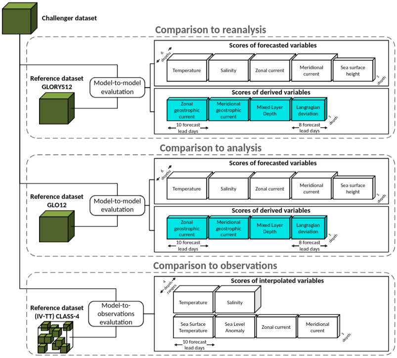

.. SPDX-FileCopyrightText: 2025 Mercator Ocean International <https://www.mercator-ocean.eu/>
..
.. SPDX-License-Identifier: EUPL-1.2

.. _evaluation-methods-page:

===================================================
Definitions of evaluation methods
===================================================

Several methods are used to evaluate forecasting systems in OceanBench.
Each of them is applied to a dataset grouping 52 forecasts in the year 2024.

The following figure provides an overview of the evaluation methodology, illustrating the multifaceted evaluation strategy that captures different aspects of model performance.
This includes (i) observation-based intercomparison, (ii) reference-model benchmarking, and (iii) process-oriented diagnostics derived from physically meaningful variables.
Together, these components provide a holistic view of each model’s ability to reproduce observed ocean dynamics, maintain internal physical consistency, and generalize beyond the training regime.

Reference datasets
**********************************************

OceanBench evaluates challengers against the following reference datasets:

- `2024 GLORYS reanalysis <https://data.marine.copernicus.eu/product/GLOBAL_MULTIYEAR_PHY_001_030>`_
- `2024 GLO12 analysis <https://data.marine.copernicus.eu/product/GLOBAL_ANALYSISFORECAST_PHY_001_024>`_

You can open and explore these datasets by using the :mod:`oceanbench.datasets.reference` module.

For gridded RMSD metrics, OceanBench computes an area-weighted spatial mean of squared errors using ``cos(latitude)`` weights, so each grid cell contributes in proportion to the ocean area it represents rather than counting equally, ignoring missing land values during the weighted reduction, then averages the daily RMSE over forecast initialization days.

Root Mean Square Deviation (RMSD) of variables compared to GLORYS reanalysis
**********************************************************************************************

The area-weighted (cos latitude) `Root Mean Square Deviation (RMSD) <https://en.wikipedia.org/wiki/Root_mean_square_deviation>`_ between the challenger dataset and the GLORYS reanalysis dataset, i.e., over all dataset variables.

Only 6 depths are used:

- Surface (~0.49 meters)
- 50 m (~47 meters)
- 100 m (~92 meters)
- 200 m (~223 meters)
- 300 m (~318 meters)
- 500 m (~541 meters)

Root Mean Square Deviation (RMSD) of Mixed Layer Depth (MLD) compared to GLORYS reanalysis
**********************************************************************************************

The area-weighted (cos latitude) `Root Mean Square Deviation (RMSD) <https://en.wikipedia.org/wiki/Root_mean_square_deviation>`_ between the two `Mixed Layer Depth (MLD) <https://en.wikipedia.org/wiki/Mixed_layer>`_ computations over the challenger dataset and the GLORYS reanalysis dataset.

The mixed layer depth is computed in meters on each dataset's native vertical grid using depth levels up to 600 meters with a density threshold of 0.03 kg/m³.
The reported value is one of the source depth levels, not an interpolated threshold-crossing depth.
If the threshold is not reached within the capped profile, OceanBench reports the deepest finite level available within the cap; in deep-water columns, mixed layers deeper than 600 meters are therefore reported as 600 meters.
This native-grid diagnostic preserves each system's represented vertical structure; vertical resolution therefore affects cross-challenger comparability.

Root Mean Square Deviation (RMSD) of geostrophic currents compared to GLORYS reanalysis
**********************************************************************************************

The area-weighted (cos latitude) `Root Mean Square Deviation (RMSD) <https://en.wikipedia.org/wiki/Root_mean_square_deviation>`_ between the two `geostrophic current <https://en.wikipedia.org/wiki/Geostrophic_current>`_ computations over the challenger datasets and the GLORYS reanalysis dataset.

The geostrophic currents are computed using sea surface height above geoid with Coriolis parameters Omega of 7.2921e-5, R of 6371000, and a gravity of 9.81 m/s². The Equator (latitude between -0.5° and 0.5°) is excluded.

Deviation of Lagrangian trajectories compared to GLORYS reanalysis
**********************************************************************************************

The deviation in kilometers between the two sets of drifting particles computed over the challenger datasets and the GLORYS reanalysis dataset.

The particles are seeded by sampling ocean grid points without replacement using ``cos(latitude)``-weighted probabilities, then simulated over the area.

Root Mean Square Deviation (RMSD) of variables compared to GLO12 analysis
**********************************************************************************************

The area-weighted (cos latitude) `Root Mean Square Deviation (RMSD) <https://en.wikipedia.org/wiki/Root_mean_square_deviation>`_ between the challenger dataset and the GLO12 analysis dataset, i.e., over all dataset variables.

Only 6 depths are used:

- Surface (~0.49 meters)
- 50 m (~47 meters)
- 100 m (~92 meters)
- 200 m (~223 meters)
- 300 m (~318 meters)
- 500 m (~541 meters)

Root Mean Square Deviation (RMSD) of Mixed Layer Depth (MLD) compared to GLO12 analysis
**********************************************************************************************

The area-weighted (cos latitude) `Root Mean Square Deviation (RMSD) <https://en.wikipedia.org/wiki/Root_mean_square_deviation>`_ between the two `Mixed Layer Depth (MLD) <https://en.wikipedia.org/wiki/Mixed_layer>`_ computations over the challenger dataset and the GLO12 analysis dataset.

The mixed layer depth is computed in meters on each dataset's native vertical grid using depth levels up to 600 meters with a density threshold of 0.03 kg/m³.
The reported value is one of the source depth levels, not an interpolated threshold-crossing depth.
If the threshold is not reached within the capped profile, OceanBench reports the deepest finite level available within the cap; in deep-water columns, mixed layers deeper than 600 meters are therefore reported as 600 meters.
This native-grid diagnostic preserves each system's represented vertical structure; vertical resolution therefore affects cross-challenger comparability.

Root Mean Square Deviation (RMSD) of geostrophic currents compared to GLO12 analysis
**********************************************************************************************

The area-weighted (cos latitude) `Root Mean Square Deviation (RMSD) <https://en.wikipedia.org/wiki/Root_mean_square_deviation>`_ between the two `geostrophic current <https://en.wikipedia.org/wiki/Geostrophic_current>`_ computations over the challenger datasets and the GLO12 analysis dataset.

The geostrophic currents are computed using sea surface height above geoid with Coriolis parameters Omega of 7.2921e-5, R of 6371000, and a gravity of 9.81 m/s². The Equator (latitude between -0.5° and 0.5°) is excluded.

Deviation of Lagrangian trajectories compared to GLO12 analysis
**********************************************************************************************

The deviation in kilometers between the two sets of drifting particles computed over the challenger datasets and the GLO12 analysis dataset.

The particles are seeded by sampling ocean grid points without replacement using ``cos(latitude)``-weighted probabilities, then simulated over the area.

Marine Heatwave diagnostics
**********************************************

OceanBench evaluates surface Marine Heatwave (MHW) forecasts following the event definition of
`Hobday et al. (2016) <https://doi.org/10.1016/j.pocean.2015.12.014>`_. At each horizontal grid point,
sea-surface temperature is compared with the seasonally varying 90th-percentile threshold. A MHW is
detected when this threshold is exceeded for at least five consecutive days. After events shorter than
five days have been removed, internal gaps of at most two days between detected periods are filled.
The same detection procedure and climatology are applied to the challenger and reference temperatures.

The daily climatological mean and 90th-percentile threshold are derived from the 1993--2022 GLORYS12V1
reference period. OceanBench currently provides climatologies for the native 1/12 degree and 1/4 degree
evaluation tracks. MHW diagnostics are not computed for the 1 degree track because no compatible
climatology is currently available.

For forecast initializations after the first one in an evaluation collection, seven days of analysis
history are prepended before detecting events. GLO12 analysis supplies the challenger history. The
reference history is supplied by GLORYS for the comparison with GLORYS reanalysis and by GLO12 for the
comparison with GLO12 analysis. This context prevents an event already in progress at forecast
initialization from being treated as a new short event. The history is used only for detection: reported
scores are restricted to the original forecast lead days. The first initialization is retained and
evaluated without preceding history when it is unavailable.

Detection scores
^^^^^^^^^^^^^^^^^^^^^^^^^^^^^^^^^^^^^^^^^^^^^^

Let :math:`TP`, :math:`FP`, and :math:`FN` denote the area-weighted numbers of grid points and forecast
initializations classified as true positives, false positives, and false negatives, respectively. The
weights are proportional to :math:`\cos(\mathrm{latitude})`. OceanBench reports one value for each
forecast lead day:

.. math::

   \mathrm{POD} = \frac{TP}{TP + FN},

.. math::

   \mathrm{FAR} = \frac{FP}{TP + FP},

.. math::

   \mathrm{CSI} = \frac{TP}{TP + FP + FN}.

The probability of detection (POD) measures the fraction of reference MHW occurrences detected by the
challenger. The false alarm ratio (FAR) measures the fraction of challenger detections absent from the
reference. The critical success index (CSI), also known as intersection over union (IoU), combines missed
events and false alarms in a single score. A zero denominator produces a missing score rather than an
arbitrary perfect or null value.

Intensity score
^^^^^^^^^^^^^^^^^^^^^^^^^^^^^^^^^^^^^^^^^^^^^^

Following the MHW intensity definition of Hobday et al. (2016), intensity is the temperature anomaly
relative to the daily climatological mean, not merely the exceedance above the 90th-percentile threshold:

.. math::

   I(t, x, y) = T(t, x, y) - T_{\mathrm{clim}}(t, x, y).

Intensity is set to zero outside each product's detected MHW mask. The intensity RMSE is evaluated over
the union of the challenger and reference MHW masks and is reduced over forecast initializations and
horizontal grid points using :math:`\cos(\mathrm{latitude})` area weights. It is reported independently
for every forecast lead day:

.. math::

   \mathrm{RMSE}_{I} =
   \sqrt{\frac{\sum w\,\left(I_{\mathrm{challenger}}-I_{\mathrm{reference}}\right)^2}
   {\sum w}}, \qquad w = \cos(\mathrm{latitude}).

These diagnostics evaluate binary MHW occurrence and intensity on surface-temperature fields. They do
not currently identify connected multi-dimensional events, track spatial objects through time, or score
the MHW severity categories introduced by
`Hobday et al. (2018) <https://doi.org/10.5670/oceanog.2018.205>`_. Such object-based diagnostics are
outside the present OceanBench implementation; for a broader review of MHW definitions and properties,
see `Oliver et al. (2021) <https://doi.org/10.1146/annurev-marine-032720-095144>`_.
