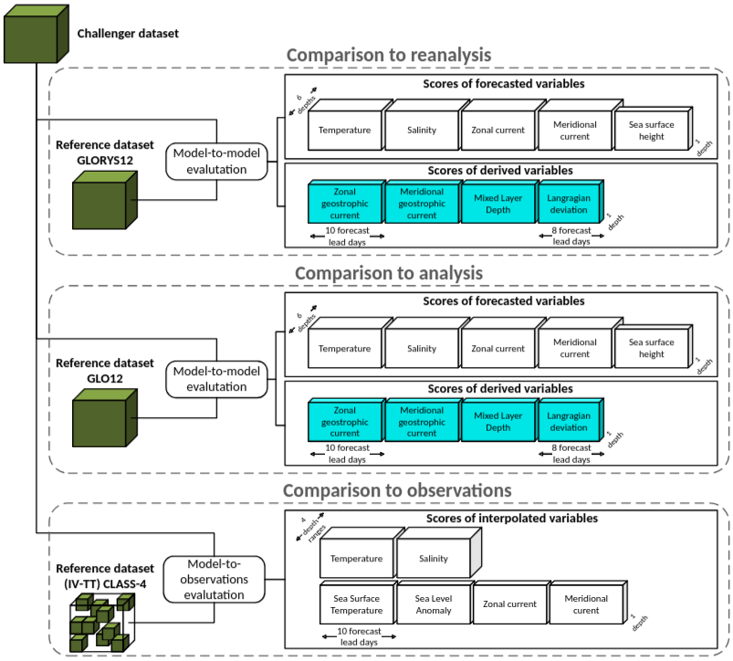

.. SPDX-FileCopyrightText: 2025 Mercator Ocean International <https://www.mercator-ocean.eu/>
..
.. SPDX-License-Identifier: EUPL-1.2

.. _evaluation-methods-page:

===================================================
Definitions of evaluation methods
===================================================

Several methods are used to evaluate forecasting systems in OceanBench.
Each of them is applied to a dataset grouping 52 forecasts in the year 2024.

The following figure provides an overview of the evaluation methodology, illustrating the multifaceted evaluation strategy that captures different aspects of model performance.
This includes (i) observation-based intercomparison, (ii) reference-model benchmarking, and (iii) process-oriented diagnostics derived from physically meaningful variables.
Together, these components provide a holistic view of each model’s ability to reproduce observed ocean dynamics, maintain internal physical consistency, and generalize beyond the training regime.

Reference datasets
**********************************************

OceanBench evaluates challengers against the following reference datasets:

- `2024 GLORYS reanalysis <https://data.marine.copernicus.eu/product/GLOBAL_MULTIYEAR_PHY_001_030>`_
- `2024 GLO12 analysis <https://data.marine.copernicus.eu/product/GLOBAL_ANALYSISFORECAST_PHY_001_024>`_
- 2024 in situ and satellite observations (Argo profiles, surface drifters, along track altimetry) from the Copernicus Marine Service, prepared as described in ``helper_scripts/observations2024_v2/README.md``

You can open and explore these datasets by using the :mod:`oceanbench.datasets.reference` module.

The OceanBench ocean mask says which cells of the twelfth of a degree grid are ocean. A cell is ocean when it is wet in both the GLO12 and GLORYS12 official static masks, so every metric scores the same area whatever its reference. It is defined at the six standard depths and at 643.57 m, the first level below 600 m.

Class IV scores follow the IV-TT CLASS-4 framework (`Hernandez et al., 2009 <https://doi.org/10.5670/oceanog.2009.71>`_, `Ryan et al., 2015 <https://doi.org/10.1080/1755876X.2015.1022330>`_, `Divakaran et al., 2015 <https://doi.org/10.1080/1755876X.2015.1022333>`_): each forecast is compared with the observations at the observation time, position and depth, and the RMSD is reported per variable, depth bin and lead day. The observation selection and quality control applied when building the observation store are documented in the README above. Temperature and salinity are scored in depth bins down to 600 m. A challenger whose deepest level is shallower than 600 m is still scored on the full range, with its deepest level standing in for the missing depths.

Class IV observation-based scores use the rebuilt ``observations2024-v2`` store, policy version ``2024-v2.1.0``: only quality control flag 1 observations are kept, drifter currents come from the filtered (FILTR) basis with wind slippage subtracted and undrogued platforms blanked, and sea level anomalies are bounded at 2 meters.
Observation scores produced with this store are not comparable to scores produced with the legacy ``observations2024`` bucket, which used a raw, unfiltered basis.

Class IV scores the same observations for every challenger, whatever its grid. An observation is kept only when the four quarter degree cells around it are entirely ocean in the ocean mask, at the first mask depth at or below it. This drops observations right at the coast, in narrow straits and below the mask seafloor.

``Observations`` gives the number of these observations at the first lead day, and ``Missing`` how many of them the challenger has no value for; those are left out of the RMSD.

For gridded RMSD metrics, OceanBench takes the ``cos(latitude)`` area-weighted mean of squared errors over the scored cells, so each cell counts in proportion to its area, then averages the daily RMSD over forecast initialization days.
A cell is scored when it is ocean in the ocean mask and both the challenger and the reference have a value there. On a challenger grid other than the twelfth of a degree one, each cell takes the nearest mask cell. ``Missing fraction`` gives, per variable and depth, the area-weighted share of ocean cells where the reference has a value and the challenger has none. It is averaged over initialization and lead days and does not change the RMSD.

Root Mean Square Deviation (RMSD) of variables compared to GLORYS reanalysis
**********************************************************************************************

The area-weighted (cos latitude) `Root Mean Square Deviation (RMSD) <https://en.wikipedia.org/wiki/Root_mean_square_deviation>`_ between the challenger dataset and the GLORYS reanalysis dataset, i.e., over all dataset variables.

Only 6 depths are used:

- Surface (~0.49 meters)
- 50 m (~47 meters)
- 100 m (~92 meters)
- 200 m (~223 meters)
- 300 m (~318 meters)
- 500 m (~541 meters)

Root Mean Square Deviation (RMSD) of Mixed Layer Depth (MLD) compared to GLORYS reanalysis
**********************************************************************************************

The area-weighted (cos latitude) `Root Mean Square Deviation (RMSD) <https://en.wikipedia.org/wiki/Root_mean_square_deviation>`_ between the two `Mixed Layer Depth (MLD) <https://en.wikipedia.org/wiki/Mixed_layer>`_ computations over the challenger dataset and the GLORYS reanalysis dataset.

The mixed layer depth is computed in meters on each dataset's native vertical grid using depth levels up to 600 meters with a density threshold of 0.03 kg/m³.
The reported value is one of the source depth levels, not an interpolated threshold-crossing depth.
If the threshold is not reached within the capped profile, OceanBench reports the deepest finite level available within the cap; in deep-water columns, mixed layers deeper than 600 meters are therefore reported as 600 meters.
This native-grid diagnostic preserves each system's represented vertical structure; vertical resolution therefore affects cross-challenger comparability.

Root Mean Square Deviation (RMSD) of geostrophic currents compared to GLORYS reanalysis
**********************************************************************************************

The area-weighted (cos latitude) `Root Mean Square Deviation (RMSD) <https://en.wikipedia.org/wiki/Root_mean_square_deviation>`_ between the two `geostrophic current <https://en.wikipedia.org/wiki/Geostrophic_current>`_ computations over the challenger datasets and the GLORYS reanalysis dataset.

The geostrophic currents are computed using sea surface height above geoid with an Earth rotation rate of 7.2921e-5 s⁻¹, an Earth radius of 6371 km and a gravity of 9.81 m/s². Latitudes within 5° of the Equator are excluded, where the Coriolis parameter vanishes and altimetry products switch to an equatorial formulation (`Lagerloef et al., 1999 <https://doi.org/10.1029/1999JC900197>`_).

Deviation of Lagrangian trajectories compared to GLORYS reanalysis
**********************************************************************************************

The deviation in kilometers between the two sets of drifting particles computed over the challenger datasets and the GLORYS reanalysis dataset.

The particles are seeded by sampling ocean grid points without replacement using ``cos(latitude)``-weighted probabilities, then simulated over the area.

The particles are released on the first forecast day, and lead day N is the mean separation on forecast day N, so the scores start at lead day 2.

Root Mean Square Deviation (RMSD) of variables compared to GLO12 analysis
**********************************************************************************************

The area-weighted (cos latitude) `Root Mean Square Deviation (RMSD) <https://en.wikipedia.org/wiki/Root_mean_square_deviation>`_ between the challenger dataset and the GLO12 analysis dataset, i.e., over all dataset variables.

Only 6 depths are used:

- Surface (~0.49 meters)
- 50 m (~47 meters)
- 100 m (~92 meters)
- 200 m (~223 meters)
- 300 m (~318 meters)
- 500 m (~541 meters)

Root Mean Square Deviation (RMSD) of Mixed Layer Depth (MLD) compared to GLO12 analysis
**********************************************************************************************

The area-weighted (cos latitude) `Root Mean Square Deviation (RMSD) <https://en.wikipedia.org/wiki/Root_mean_square_deviation>`_ between the two `Mixed Layer Depth (MLD) <https://en.wikipedia.org/wiki/Mixed_layer>`_ computations over the challenger dataset and the GLO12 analysis dataset.

The mixed layer depth is computed in meters on each dataset's native vertical grid using depth levels up to 600 meters with a density threshold of 0.03 kg/m³.
The reported value is one of the source depth levels, not an interpolated threshold-crossing depth.
If the threshold is not reached within the capped profile, OceanBench reports the deepest finite level available within the cap; in deep-water columns, mixed layers deeper than 600 meters are therefore reported as 600 meters.
This native-grid diagnostic preserves each system's represented vertical structure; vertical resolution therefore affects cross-challenger comparability.

Root Mean Square Deviation (RMSD) of geostrophic currents compared to GLO12 analysis
**********************************************************************************************

The area-weighted (cos latitude) `Root Mean Square Deviation (RMSD) <https://en.wikipedia.org/wiki/Root_mean_square_deviation>`_ between the two `geostrophic current <https://en.wikipedia.org/wiki/Geostrophic_current>`_ computations over the challenger datasets and the GLO12 analysis dataset.

The geostrophic currents are computed using sea surface height above geoid with an Earth rotation rate of 7.2921e-5 s⁻¹, an Earth radius of 6371 km and a gravity of 9.81 m/s². Latitudes within 5° of the Equator are excluded, where the Coriolis parameter vanishes and altimetry products switch to an equatorial formulation (`Lagerloef et al., 1999 <https://doi.org/10.1029/1999JC900197>`_).

Deviation of Lagrangian trajectories compared to GLO12 analysis
**********************************************************************************************

The deviation in kilometers between the two sets of drifting particles computed over the challenger datasets and the GLO12 analysis dataset.

The particles are seeded by sampling ocean grid points without replacement using ``cos(latitude)``-weighted probabilities, then simulated over the area.

The particles are released on the first forecast day, and lead day N is the mean separation on forecast day N, so the scores start at lead day 2.

Ensemble (probabilistic) evaluation
**********************************************************************************************

Two ensembles are evaluated over 2024 on 52 weekly starts: GloEns, the Mercator Ocean physics ensemble with 50 members and lead days 1 to 10, and GLOW-ens, the GLOW machine learning ensemble with 16 members and lead days 1 to 9.
GloEns is initialised on a Thursday, so its first forecast day is a Friday, while the other systems have their first forecast day on a Wednesday: at a given lead day, GloEns is scored two days later.
They are compared against the version 2 observation basis of OceanBench and against the quarter degree `GLORYS reanalysis <https://data.marine.copernicus.eu/product/GLOBAL_MULTIYEAR_PHY_001_030>`_.
Two deterministic forecasts are kept next to the ensemble means as references: GLONET, the machine learning system, and GLO12, the physics system GloEns starts from.

The following scores are reported, per variable, depth and lead day:

- Ensemble mean RMSD: the root mean square deviation of the mean of the members. Against observations it is scored exactly as the deterministic forecasts are, so it reads directly against them. Lower is better.
- Fair CRPS: the continuous ranked probability score with the finite ensemble correction of Ferro (2014), which compares the whole distribution of the members with the reference. It is in the unit of the variable, and lower is better.
- Spread-error ratio: the ensemble spread divided by the RMSD of the ensemble mean. A value of 1 means the spread matches the error, and a value below 1 means the ensemble is too confident. Against GLORYS it carries no observation or analysis error, so it reads low: it measures agreement with the analysis, not calibration.
- Rank histograms: for each observation, the rank of the observed value among the members. They are drawn against observations only.

Against observations, every score uses the same Class IV matchup, one observation at a time, with each member matched to every observation.

Observation error (sigma) is estimated from the observation data itself, as a map varying by month, depth and variable, from the sigma lookup artifact ``sigma-lookup-v3.1.0.zarr``.
It is used in two places only.
In the spread-error ratio against observations, the mean observation error variance is added to the ensemble variance before the ratio is taken.
In the rank histograms, every member receives its own random draw of observation error before the ranking, and the histogram is averaged over 4 such draws.
The CRPS and RMSD scores never use it.

GloEns ranks fall into 51 bins and GLOW-ens ranks into 17, so the GloEns ranks are merged three at a time onto the same 17 bins.
The "All days" histogram pools lead days 1 to 9, which both ensembles cover.
A flat histogram is a calibrated ensemble, a U shape an under-dispersive one, a dome an over-dispersive one, and a slope a bias.

Limitations: the scores do not have confidence intervals (for example from a bootstrap over starts) yet.
The realism of individual members (for example their spatial spectra) is not checked yet.
