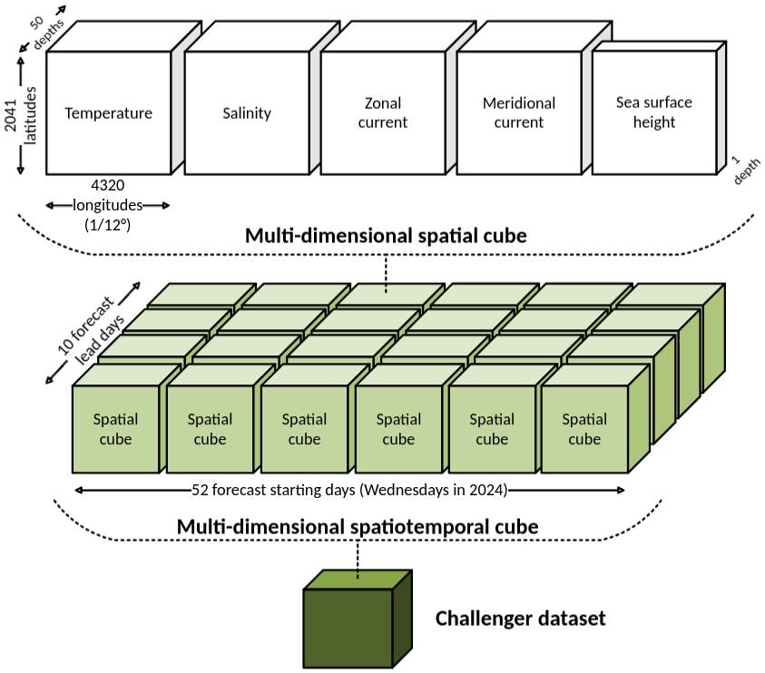

.. SPDX-FileCopyrightText: 2025 Mercator Ocean International <https://www.mercator-ocean.eu/>
..
.. SPDX-License-Identifier: EUPL-1.2

.. _evaluation-methods-page:

===================================================
Shape of the challenger dataset
===================================================

For people used to Python, `xarray <https://docs.xarray.dev/en/stable/index.html>`_ and `dask <https://www.dask.org/>`_, the fastest way to get an idea of the needed challenger datacube is to look at `this notebook <https://github.com/mercator-ocean/oceanbench/blob/main/assets/glonet_sample.report.ipynb>`_.

The following figure provide an illustration of the shape of a challenger datasets at a 1/12° resolution.

The challenger dataset must contains all 10-days forecasts starting the 52 Wednesdays of year 2024.

Hence, it must be a datacube with at least 5 dimensions and 5 variables as defined in the `Climate Forecast Convention (CF) <https://cfconventions.org>`_.

Dimensions:

- Latitude (standard grid)
- Longitude (standard grid)
- Depth (positive depth level in the ocean)
- Lead day index (from 0 to 9, corresponding to the 10 days of forecasts)
- First day datetime (datetime of the first day of forecast)

Variables:

- Sea surface height above geoid (over all dimensions except depth)
- Sea water potential temperature (over all dimensions)
- Sea water salinity (over all dimensions)
- Northward sea water velocity (over all dimensions, also named meridional current)
- Eastward sea water velocity (over all dimensions, also named zonal current)

The challenger dataset dimensions and variables must be named after the `Climate Forecast Convention (CF) standard names <https://cfconventions.org/Data/cf-standard-names/current/build/cf-standard-name-table.html>`_ or have a `standard_name` attribute containing the corresponding CF standard name.

The challenger dataset should be opened as an `xarray.Dataset <https://xarray.pydata.org/en/v2023.11.0/generated/xarray.Dataset.html>`_, with explicit `dask chunks <https://docs.dask.org/en/stable/array-chunks.html>`_ for best performances.

Finally, OceanBench supports challenger dataset with 1/12° resolution or with 1/4° resolution.
