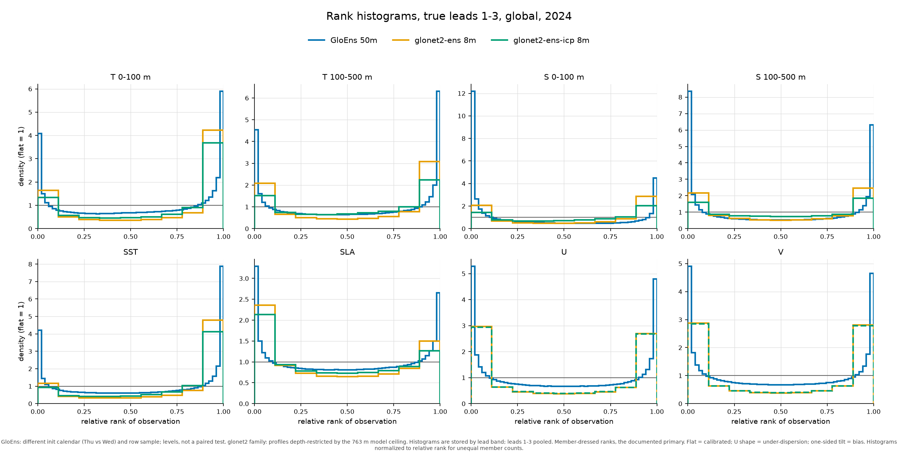

<!--
SPDX-FileCopyrightText: 2025 Mercator Ocean International <https://www.mercator-ocean.eu/>

SPDX-License-Identifier: EUPL-1.2
-->

---
description: "OceanBench is a benchmarking tool to evaluate ocean forecasting systems against reference ocean datasets and observations."
hide-description: true
author: "Mercator Ocean"
jupyter: python3
format:
  html:
    echo: false
    page-layout: full
---

<div style="text-align: left; margin: 0;">
  
  
</div>


# Evaluating ocean forecasting systems

OceanBench is a benchmarking tool to evaluate ocean forecasting systems against reference ocean analysis datasets (such as 2024 [GLORYS reanalysis](https://data.marine.copernicus.eu/product/GLOBAL_MULTIYEAR_PHY_001_030) and [GLO12 analysis](https://data.marine.copernicus.eu/product/GLOBAL_ANALYSISFORECAST_PHY_001_024)) as well as observations.

Evaluating ocean forecast performance is a complex task, as different users have varying priorities.
Some may focus on accurate predictions of currents, while others prioritize sea level or salinity forecasts.
To accommodate these diverse needs, OceanBench provides a comprehensive set of metrics.
Please keep in mind that these metrics capture key aspects of forecast quality rather than the complete picture.

Want to evaluate your system or get involved in OceanBench? Check out the [GitHub project](https://github.com/mercator-ocean/oceanbench/)!

For the 1 degree track, the interpolation method used for challengers, the corresponding reference datasets, and the exact implementation paths are documented [here](https://oceanbench.readthedocs.io/en/latest/one-degree-track.html).

```{python}
#| output: false

import json
import os
from helpers.s3_discovery import available_versions, default_version, discover_downloaded_reports
from helpers.notebook_score_parser import get_all_model_scores_from_notebook, METRIC_TITLES, SECTIONS
from helpers.challenger_metadata import challenger_label
from helpers.published_regions import published_region_ids_with_reports, published_region_label, published_region_metadata
from helpers.ensemble_scores import ensemble_score_bundle

def _load_scores(version, challenger_name, region_id, strict):
    local_path = os.path.join("reports", version, f"{challenger_name}.{region_id}.report.ipynb")
    if not os.path.exists(local_path):
        return None
    try:
        scores = get_all_model_scores_from_notebook(local_path, challenger_name)
    except Exception as error:
        if strict:
            raise
        print(f"Skipping {version}/{challenger_name}.{region_id}: {error}")
        return None
    if not scores:
        if strict:
            raise RuntimeError(f"No scores parsed for {version}/{challenger_name}.{region_id}.")
        return None
    return {metric_key: score.model_dump() for metric_key, score in scores.items()}

def _version_bundle(version, strict):
    published_reports = discover_downloaded_reports("reports", version)
    regions = {}
    for region_id in published_region_ids_with_reports(published_reports):
        challengers = {
            challenger_name: scores
            for challenger_name in published_reports[region_id]
            if (scores := _load_scores(version, challenger_name, region_id, strict))
        }
        if not challengers:
            continue
        regions[region_id] = {
            "display_name": published_region_label(region_id),
            "challengers": challengers,
            "challenger_names": list(challengers.keys()),
        }
    region_ids = list(regions.keys())
    return {
        "regions": regions,
        "region_order": region_ids,
        "region_labels": {region_id: published_region_label(region_id) for region_id in region_ids},
        "region_metadata": {region_id: published_region_metadata(region_id) for region_id in region_ids},
        "challenger_labels": {
            challenger_name: challenger_label(challenger_name)
            for region in regions.values()
            for challenger_name in region["challenger_names"]
        },
    }

resolved_default_version = default_version()
version_bundles = {
    version: bundle
    for version in available_versions()
    if (bundle := _version_bundle(version, strict=version == resolved_default_version))["region_order"]
}
if resolved_default_version not in version_bundles:
    resolved_default_version = next(iter(version_bundles), "")

scores_json = json.dumps({
    "versions": version_bundles,
    "version_order": list(version_bundles.keys()),
    "default_version": resolved_default_version,
    "metric_titles": METRIC_TITLES,
    "sections": SECTIONS,
})

ensemble_scores_json = json.dumps(ensemble_score_bundle())
```

```{python}
#| output: asis

print(f'<script type="application/json" id="scores-data">{scores_json}</script>')
print(f'<script type="application/json" id="ensemble-scores-data">{ensemble_scores_json}</script>')
```

::::: {#all-scores}

::: {#deterministic-view}

## Comparison to observations

Absolute RMSE scores against in-situ observations (Class IV validation). The colors denote % difference to the selected baseline.

<div id="observations-scores"></div>

## Comparison to reanalysis

Absolute RMSE scores against 2024 [GLORYS reanalysis](https://data.marine.copernicus.eu/product/GLOBAL_MULTIYEAR_PHY_001_030). These are the deterministic scores for the forecasted variables and physically consistent diagnostic variables. The colors denote % difference to the selected baseline.

<div id="reanalysis-scores"></div>

## Comparison to analysis

Absolute RMSE scores against 2024 [GLO12 analysis](https://data.marine.copernicus.eu/product/GLOBAL_ANALYSISFORECAST_PHY_001_024). These are the deterministic scores for the forecasted variables and physically consistent diagnostic variables. The colors denote % difference to the selected baseline.

<div id="analysis-scores"></div>

:::

::: {#ensemble-view hidden="true"}

Two ensembles are evaluated over 2024 on 52 weekly starts, against the version 2 observation basis of OceanBench and the quarter degree [GLORYS reanalysis](https://data.marine.copernicus.eu/product/GLOBAL_MULTIYEAR_PHY_001_030): GloEns, the Mercator Ocean physics ensemble with 50 members, and GloNet2-ens-icp, the GloNet2 machine learning ensemble with 8 perturbed initial conditions. Two deterministic forecasts are kept next to the ensemble means as references: GLONET, the machine learning system, and GLO12, the physics system both of them start from.

```{=html}
<details class="ensemble-details">
<summary>How to read these numbers</summary>
<p><strong>Comparing to observations.</strong> Forecasts predict the average state of a roughly 25 km grid cell. A single buoy or float measures one point inside that cell, so part of the difference between forecast and observation is not forecast error at all: it is small-scale ocean variability and instrument noise the forecast is not trying to predict. The error table takes no shortcut around this: the mean of each ensemble is scored exactly as a deterministic forecast is, one observation at a time through the class 4 matchup of OceanBench, so its rows can be read straight against the two references. The probabilistic scores need the individual members, and they come from a second matchup that first averages the observations inside a grid cell, which puts the forecast and the observation at the same scale. For the spread-error ratio we also estimated how large the remaining observation noise is, from the observation data itself, as a map varying by month, depth, and variable, and we account for it when judging whether the ensemble spread is large enough. This estimated observation noise is used only for the spread-error ratio; the CRPS and RMSD numbers never use it.</p>
<p><strong>Why some CRPS values improve with forecast lead.</strong> For these systems the error grows only slowly over the forecast range while the ensemble spread grows faster. A probabilistic score rewards spread that matches error, so the score can improve with lead even though the error itself does not shrink. It reflects the ensembles being too confident at short lead, not the forecast getting better with time.</p>
</details>
```

## Ensemble means and deterministic references (vs observations) {#ensemble-observations}

<div id="ensemble-observations-scores"></div>

## Ensemble means (vs GLORYS) {#ensemble-gridded}

<div id="ensemble-gridded-scores"></div>

## Probabilistic skill {#ensemble-probabilistic}

<div id="ensemble-probabilistic-scores"></div>

```{=html}
<div class="depth-section">
<h3>Rank histograms against observations</h3>

<p class="ensemble-table-note">Leads 1 to 3 pooled. A flat histogram is a calibrated ensemble, a U shape an under dispersive one.</p>
</div>
```

:::

:::::

Implemented by [Mercator Ocean](https://mercator-ocean.eu).

<a href="https://mercator-ocean.eu"></a>

```{=html}
<script src="vendor/d3-array.v3.min.js"></script>
<script src="vendor/d3-geo.v3.min.js"></script>
<script src="vendor/topojson-client.v3.min.js"></script>
<script src="region-globe.js"></script>
<script src="interactive-scores.js"></script>
```
